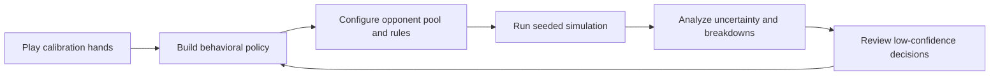
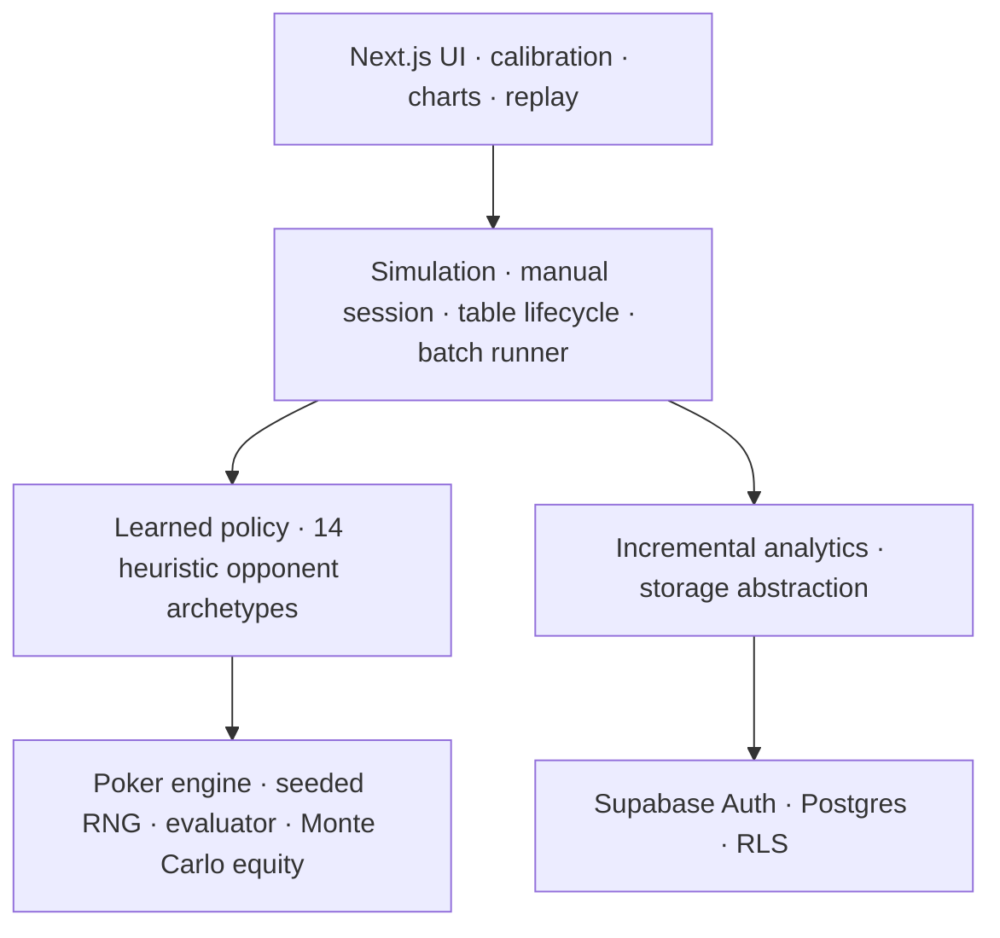

# QuantPoker

### Learn a player's poker strategy, simulate it at scale, and explain the result.

[Live demo](https://poker-sim-iota.vercel.app) · [Architecture](docs/ARCHITECTURE.md) · [Limitations](docs/LIMITATIONS.md) · [Maintainer context](PROJECT_CONTEXT.md)

QuantPoker is a behavioral modeling and reproducible backtesting platform for No-Limit Hold'em. A player completes a short calibration, the application turns those decisions into an uncertainty-aware policy, and that policy is tested across configurable poker environments.

It is designed to answer questions such as:

- How does this strategy perform against a tighter or more aggressive opponent pool?
- How much of the result is signal, and how much is normal poker variance?
- Where does the strategy win or lose: position, stack depth, pot type, sizing, or opponent archetype?
- Which simulated decisions came from player data, and which leaned on the model's prior?

> QuantPoker is a strategy-comparison instrument, not a GTO solver or an earnings forecast. Results describe a learned policy against a synthetic pool under the selected rules.

## Why this project matters

Poker players usually assess a strategy through memory, small samples, or aggregate tracker statistics. Those methods make controlled experiments difficult: the cards change, the opponents change, and variance can overwhelm the effect being measured.

QuantPoker creates a repeatable experimental loop:



The same seed, configuration, and simulation version reproduce the same cards, decisions, and table events. A user can therefore change one variable and make a much cleaner comparison.

## Hackathon demo path

For the fastest end-to-end review:

1. Open the [live application](https://poker-sim-iota.vercel.app) and create an account, or run locally in browser-only mode.
2. Choose **Range-first calibration** and select a shared or position-specific starting range.
3. Play a short sample and inspect the generated **Strategy profile**.
4. Create an experiment with a fixed seed, opponent mix, stakes, rake, and hand count.
5. Run the experiment and inspect win rate, confidence interval, drawdown, matchup, and hand-history views.
6. Open **Simulated Hand Review**, correct a low-confidence action, and rerun the same seed.
7. Duplicate the experiment, change one variable, and compare both runs side by side.

For a live presentation, prepare one completed calibration and one completed experiment in advance. A small run demonstrates execution quickly; a larger saved run better demonstrates the statistical views.

## What the system records

Calibration captures the full decision context rather than only the chosen button:

- street, position, hole cards, board, and active-player count;
- effective stack, pot, amount faced, pot odds, and stack-to-pot ratio;
- legal actions and prior action history;
- selected action and bet size as a fraction of the pot;
- real response time, timeout state, and the previous opponent's timing cue.

Range-first calibration supports one exact 169-hand chart for all seats or independent charts by position. The table can be six-handed or full ring. Calibration drafts checkpoint after every completed hand and can resume after navigation, refresh, sign-out, or closing the browser.

Calibration opponents are intentionally optimized for measurement coverage. They produce varied pressure, timing, and showdown opportunities so a limited sample teaches the model more. Calibration winnings are therefore not treated as a realistic performance estimate.

## How the learned strategy works

QuantPoker produces two separate model layers.

### Descriptive profile

The profile reports poker statistics such as VPIP, PFR, three-bet rate, continuation betting, aggression, sizing, showdown behavior, and timing. Frequencies use smoothing and Wilson 95% intervals so sparse samples do not look more certain than they are.

These statistics explain the sample; they do not directly control simulated actions.

### Generative behavioral policy

The policy groups decisions by:

```text
street × position class × facing situation × hand-strength quartile × opponent timing
```

Each bucket stores action counts, empirical bet sizes, and response-time samples. At decision time:

- observed action frequencies are blended with a strength-aware prior;
- the data weight is `n / (n + 8)`, so sparse buckets remain conservative;
- empty exact buckets fall back through broader contexts;
- timing-specific contexts can fall back to dense untimed buckets;
- probability assigned to illegal actions flows to sensible legal substitutes;
- sizing and decision time are sampled from player observations with safe priors.

Every simulated user decision records its probability distribution and data-versus-prior confidence. The results can therefore expose how much of the generated play was supported by calibration data.

## Simulation architecture

The application is layered so the simulation core is independent of React, Next.js, and the browser DOM:



### Poker engine

`HandEngine` owns blinds, dealing, betting rounds, burn cards, all-in runouts, side pots, rake, and settlement. Tests cover chip conservation, legal minimum raises, incomplete all-in raises, folded contributions, refunds, split pots, odd chips, and heads-up blind rules.

Two hand evaluators are cross-validated:

- a readable reference evaluator checks all 21 five-card combinations;
- an allocation-free bitmask evaluator powers the Monte Carlo hot path.

### Reproducible randomness

A seeded Mulberry32 generator controls shuffling, equity samples, agent choices, timing, and player turnover. Each hand stores the RNG state from before the deal. The tuple `(seed, configuration, simulation version)` determines an entire run.

### Opponent population

Fourteen heuristic archetypes represent styles such as tight-aggressive, loose-aggressive, passive, calling, bluff-heavy, and adaptive play. Profiles are parameter vectors rather than fixed scripts. Per-instance jitter prevents every instance of an archetype from behaving identically.

Preflop decisions combine hand strength, position, stack state, and profile thresholds. Postflop decisions combine seeded Monte Carlo equity, pot odds, and profile-driven value, bluff, calling, and aggression behavior. These agents are intentionally exploitable approximations, not equilibrium players.

### Table lifecycle

Experiments model session lengths, stop-loss and stop-win departures, rebuys, random turnover, short-handed play, button movement, and replacements from a weighted pool. Multiplayer runs can seat published learned policies with bots or run a players-only table.

### Batch runner

`runSimulation` is environment-agnostic. It runs an asynchronous loop in 200-hand chunks, reports progress, supports cancellation, and yields between chunks to keep the page responsive. The current browser implementation reaches roughly 1,500–2,000 hands per second on typical development hardware.

Because the core has no DOM dependency, the same runner can move to a Web Worker or server job worker without rewriting the game model.

## Analytics and review loop

The incremental aggregator performs constant work per completed hand and bounds chart data to roughly 2,000 points. It reports:

- win rate in big blinds per 100 hands and a 95% confidence interval;
- per-hand volatility, significance relative to break-even, and risk of ruin;
- bankroll curve, current drawdown, and maximum drawdown;
- profit factor, rake, and showdown/non-showdown winnings;
- position, starting-hand, stack-depth, pot-type, action, sizing, and opponent breakdowns.

Detailed runs retain hand histories. Runs over 20,000 hands automatically use high-speed mode, preserving complete aggregates plus sampled histories.

**Simulated Hand Review** samples low-confidence decisions from different stored hands, reconstructs the table immediately before each action, and hides future cards. Confirmations and corrections become higher-weight training observations. If a correction changes the policy, QuantPoker reruns the same seed to isolate the policy change from environmental randomness.

## Multiplayer and privacy

Cloud users receive unique usernames and can connect through accepted friendships. A user may explicitly publish one learned strategy snapshot to direct friends and friends of friends.

Only the serialized policy and presentation metadata are shared. Raw calibration decisions, email addresses, experiments, and hand histories remain private. Multiplayer experiments copy selected policies as point-in-time snapshots so later profile or friendship changes do not mutate an existing run.

Supabase row-level security ties private rows to `auth.uid()`. Security-definer database functions handle social graph operations, atomic experiment finalization, review commits, and the aggregate strategy leaderboard.

## Built with Codex and GPT-5.6

Codex powered by GPT-5.6 was used as an engineering copilot across the repository—not as a runtime dependency of the poker product.

The Codex-assisted workflow included:

- translating the product idea into separable engine, policy, simulation, analytics, storage, and UI layers;
- implementing and reviewing poker-rule edge cases such as side pots, minimum raises, all-ins, rake, and heads-up transitions;
- building deterministic tests for seeded runs, evaluator agreement, table turnover, policy compatibility, storage, security, and review recalibration;
- iterating on responsive calibration layouts and diagnosing mobile viewport behavior;
- designing Supabase migrations, row-level-security boundaries, and local/cloud storage parity;
- maintaining `PROJECT_CONTEXT.md` as a durable handoff between long, multi-step Codex sessions;
- running test, lint, and production-build checks after changes and documenting unresolved limitations.

Human judgment remained responsible for product direction, poker assumptions, feature selection, final review, and deployment decisions. QuantPoker's learned player policy is implemented locally in JavaScript; it does not call GPT-5.6 or another language model during calibration or simulation.

## Technology

| Layer | Technology |
|---|---|
| Application | Next.js 15 App Router, React 19, JavaScript, JSX |
| Styling | Tailwind CSS 4, custom responsive CSS |
| Validation | Zod |
| Testing | Vitest, pgTAP database assertions |
| Data visualization | Lightweight native React/SVG chart components |
| Persistence | Supabase Auth, PostgreSQL, JSONB, row-level security |
| Deployment | Vercel |

The source is JavaScript and JSX rather than TypeScript. SQL is used for database migrations, functions, grants, and security tests.

## Run locally

Prerequisites: Node.js 20 or newer and npm.

```bash
git clone https://github.com/bnjcc/poker-sim.git
cd poker-sim
npm install
npm run dev
```

Open [http://localhost:3000](http://localhost:3000).

No environment variables are required for the browser-only demo. Local storage provides the complete solo workflow with an approximately 5 MB budget and a 3,000-hand stored-history cap per experiment.

### Enable cloud mode

1. Create a Supabase project.
2. Copy `.env.example` to `.env.local`.
3. Add the project URL and publishable key:

```env
NEXT_PUBLIC_SUPABASE_URL="https://your-project-ref.supabase.co"
NEXT_PUBLIC_SUPABASE_PUBLISHABLE_KEY="sb_publishable_your-key"
```

4. Apply files in `supabase/migrations/` in timestamp order.
5. Add `http://localhost:3000/auth/confirm` and the deployed equivalent to the Supabase Auth redirect allow list.

Never expose a Supabase secret or service-role key through a `NEXT_PUBLIC_*` variable.

## Validation

```bash
npm test
npm run lint
npm run build
```

The current suite covers the engine, evaluator agreement, equity, deterministic simulation, timing, range handling, calibration, multiplayer seating, analytics, storage, redirects, review feedback, leaderboards, and responsive poker-table behavior. Database security assertions live in `supabase/tests/database/schema_and_rls.test.sql`.

## Repository map

```text
app/                    Next.js routes, calibration, profiles, experiments, auth
components/             Poker table, hand replay, range grid, charts, UI controls
lib/poker/              Engine, deck, RNG, evaluator, equity, action ledger
lib/agents/             Fourteen heuristic profiles and decision policy
lib/player-model/       Descriptive statistics, learned policy, review training
lib/simulation/         Manual calibration, table lifecycle, batch execution
lib/analytics/          Incremental aggregation and leaderboard logic
lib/storage/            Browser and Supabase implementations of one contract
lib/supabase/           Browser/server clients and session middleware
supabase/migrations/    Schema, functions, row-level security, social features
supabase/tests/         pgTAP schema and security assertions
tests/                  Vitest unit and integration coverage
docs/                   Architecture, limitations, and implementation plan
```

## Honest limitations

- The learned strategy is a bucketed statistical imitation. It cannot represent full combo-level blocker logic, multi-street planning, or every exploitative adjustment a player may make.
- Small calibration samples remain prior-dominated. The UI warns below 100 hands and exposes average model confidence.
- Opponents are synthetic heuristic archetypes. Their aggregate styles are plausible, but their postflop reasoning is simpler than strong human play.
- Equity uses Monte Carlo estimates, which introduce sampling noise.
- Batch execution is currently single-threaded in the browser, so the tab must remain open.
- Risk-of-ruin calculations assume stationary win rate and variance.
- Positive results apply only to the configured simulated environment.

See [docs/LIMITATIONS.md](docs/LIMITATIONS.md) for the full gap analysis and scaling path.

## Roadmap

1. Move batch execution into Web Workers and merge deterministic parallel shards.
2. Add a server-side job queue for transactional, resumable million-hand runs.
3. Add browser-level end-to-end smoke coverage in CI.
4. Estimate opponent populations from imported real hand histories.
5. Add exact turn and river equity enumeration.
6. Introduce finer or sequential policy models once calibration datasets justify the added complexity.

## Documentation

- [Architecture](docs/ARCHITECTURE.md) explains the engine, learned policy, analytics, storage, and scaling path.
- [Limitations](docs/LIMITATIONS.md) separates what ships from the honest modeling gap.
- [Implementation plan](docs/PLAN.md) records the original build sequence and scope decisions.
- [Project context](PROJECT_CONTEXT.md) is the current maintainer and Codex handoff.
